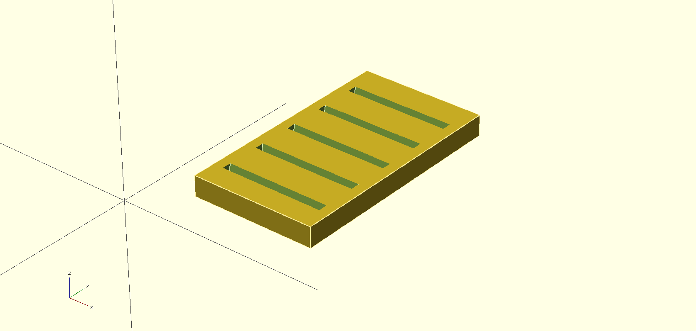

# sdhc_rack

This is a simple SDHC card storage model.

Pretty self explainatory.

It is desiged to be used as a module in OpenSCAD.

the main parameter is `number_of_slots`, which defines the number of sdcard slots you want.

## Sample (default)

